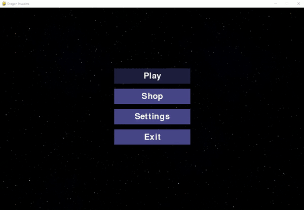
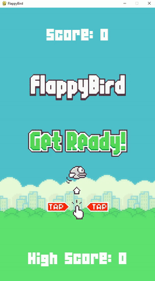

# pygames

This repository contains small games and simulations created in python using the pygame library.

# Install

Some projects may contain additional libraries in the future, so I recommend installing them in a virtual environment.

Go to the game folder and then create a virtual environment

```
$ python -m venv venv
```

Activate the virtual environment

```
$ venv\Scripts\activate
```

Install the required libraries

```
$ pip install -r requirements.txt
```

Now you can run the game

```
$ py game_name.py
```

If you have the required libraries installed globally, you can run the game immediately

# Overview

## [DragonInvaders](https://github.com/adrolc/pygames/tree/main/DragonInvaders)



## [FrappyBird](https://github.com/adrolc/pygames/tree/main/FlappyBird)



## [Bouncing ball physics simulation](https://github.com/adrolc/pygames/tree/main/Bouncing_ball_simulation)


